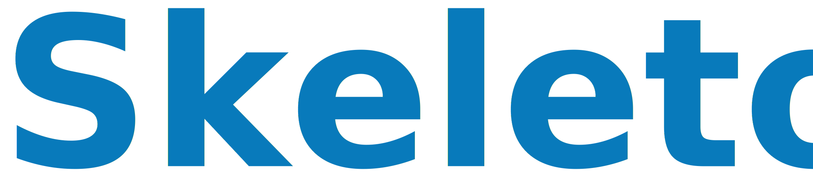

Skeleton es un framework web escrito en PHP para proyectos de pequeña magnitud. Prioriza el funcionamiento frente a la estética, dando al programador las herramientas ya preparadas. 

## Ventajas
- Sistema definido para gestores
- Estructura de capas aisladas
- Instalación de módulos
- Alta velocidad de carga
- Fácil instalación y trabajo
- Personalizable en el tiempo
